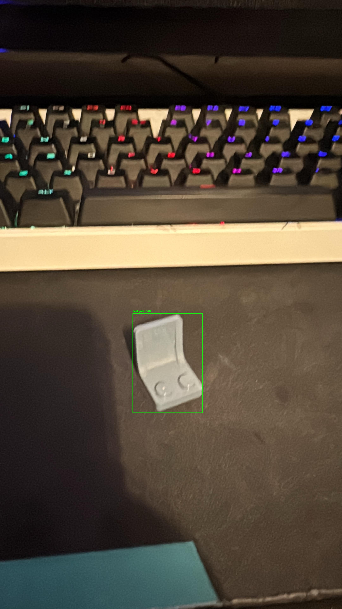
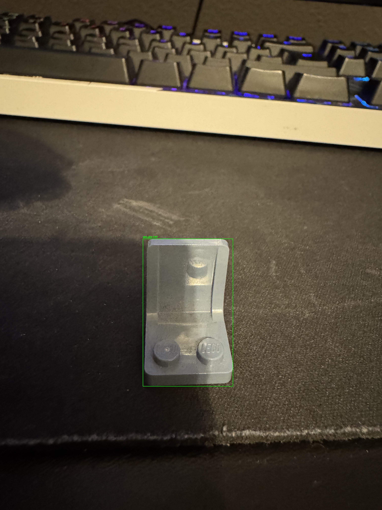
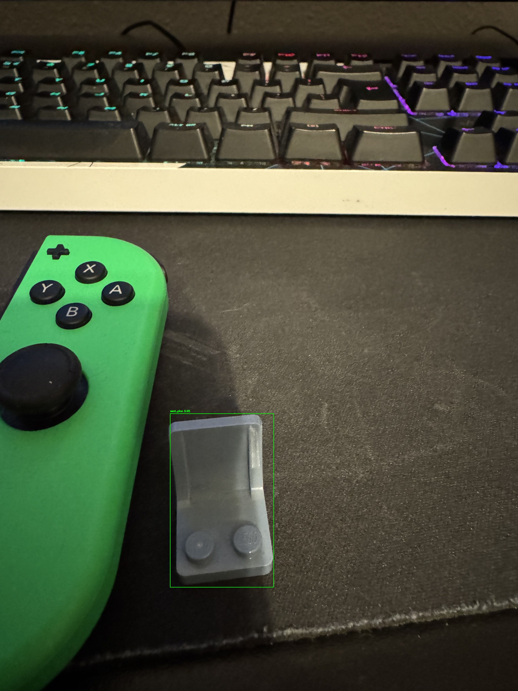
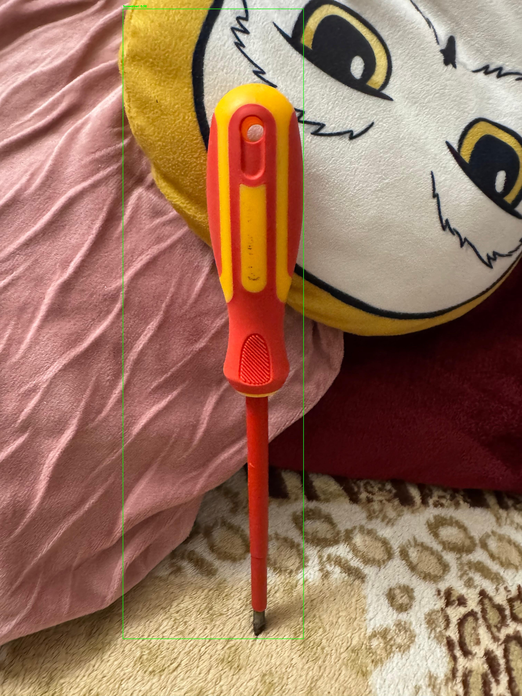
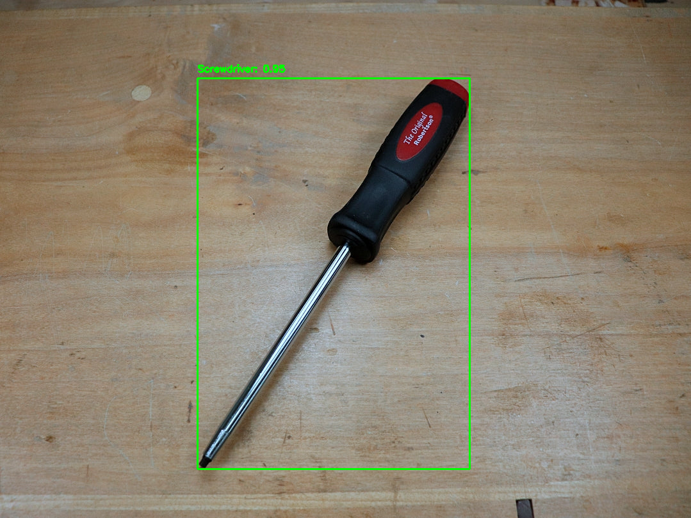
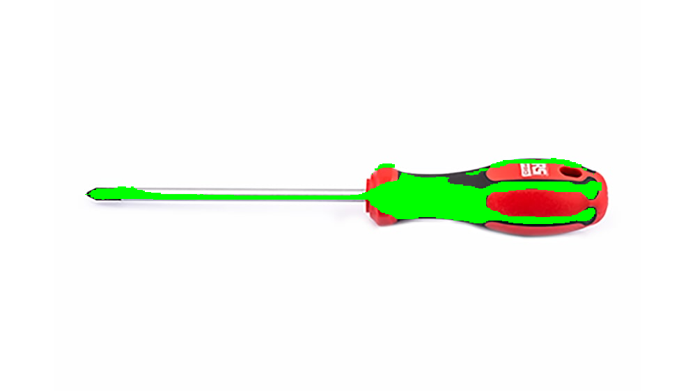
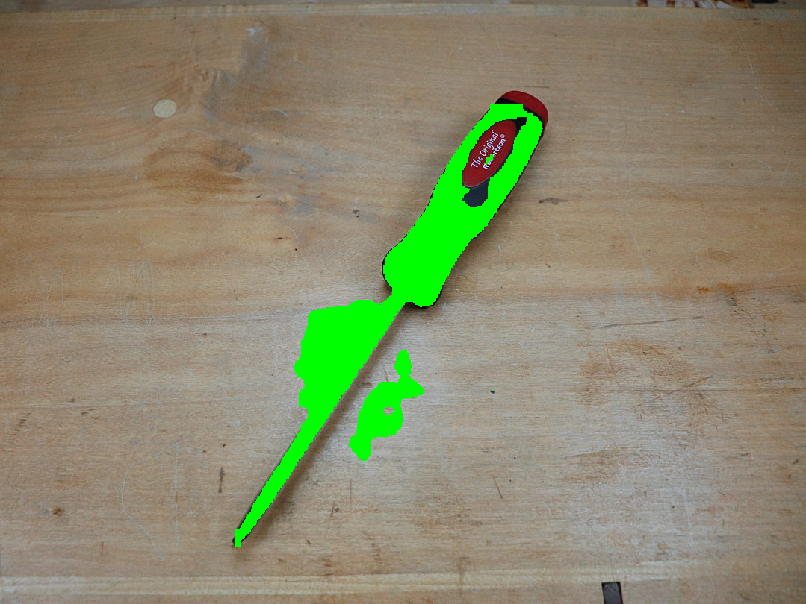

# 📄 CHANGELOG

All changes will be documented here.

## [0.6.0] - 2025-01-14
### 🚀 New Additions

Made some progress about server and android app:
- server works on PC, it retrieves, uses YOLO trained model, process images from phone correctly (see video 1)
- On unity the connection side works good. Features:
  1. checking if connected to the server, if not it trys to reconnect
  2. Capture button sends image key-frame to the server to be processed
  3. it is pretty smooth, so no lag in AR or overall app

### 🎯 **TODO**: 
- !! I am working on displaying the **bboxes** in AR mode in real time. Did not managed yet to do it. But the server process
correctly the lego bricks + **the navigating arrow** !!

- I will make the UI elements more beautiful and modern at the end.

- Adding more training data (different objects)

**Here are the videos took at the same time on server and on phone:**

---

## [0.5.0] - 2025-01-03

A recording that I did while testing yolo11n how it detects all lego pieces from a mini set:

https://github.com/user-attachments/assets/0e53a605-6893-4635-b5f6-1af7f184294b

---

## [0.4.0] - 2024-12-10

### 🔧 **Changes**
### Improved recognition

Model was trained this time on images from **Unity Perception Package** which had a significant impact on the training.

### 🎯 **TODO**
- Find an optimal number of photos to generate using Unity Perception Package
- Combine real photos with synthetic ones

---

## [0.3.0] - 2024-12-02

### 🔧 **Changes**
### Fixed recognition
A screwdriver dataset on which yolo11x was trained on (you can view the changed on train.py)

Now from the test_script.py it was able to identify a screwdriver in multiple position and different scenarios

In some cases the border may be very thin but it still finds it.

File name `camera_test.py`

It also works in real time camera

The best train so far is detect/**train16**

---

## [0.2.0] - 2024-12-02

### 🚀 New Additions
### Added
- **Training Data and Images**  
  Added screwdrivers images from every angle for training. This is still in testing until a robust database is achieved.
  Cannot upload here due to storage.
  
- **Labels**  
  Added labels for each image where each `.txt` file contains every point from the mask, calculated by `create_bbox.py`.

- **Scripts**  
  - `create_bbox.py`: Script to calculate bounding boxes and generate labels for training data.
  - `train.py`: Main training model script using YOLO11x-seg for segmentation.
  - `mask_gen.py`: Generates detail mask around the object for segmentation
  

- **Config**
  - Config file for yolo11-seg
  

- **Model Files**  
  Added `yolo11x-seg.pt` in the `models/` folder for model weights.

- **Training Results**  
  Completed six segmentation training sessions; `train4` has shown the best accuracy so far (see `test_results` folder).

- **Testing**  
  - `test_script.py`: Processes an image from `images/test` with the trained model to verify detection. Not very accurate yet

- **Output**  
  Added `test_results` folder generated by `test_script.py` for storing output from test runs.

---

## [0.1.0] - 2024-11-02

### 🚀 New Additions

- **Research Articles**  
  Pushed some research articles related to the **VWA** "Guidance" or "Mark & Guidance" in AR on mobile phone,  in the `research_articles` folder. 

---

> **Legend:**
> - 🚀 **New Additions**: New added files, and documentation on every addition.
> - 🔧 **Changes**: Something that has been modified in a previous addition.
> - 🐛 **Fixes**: Bug fixes
> - 🎯 **TODO**: TODO
---

> **Note:**  
> `CHANGELOG.md` will contain only what has changed during the implementation.
